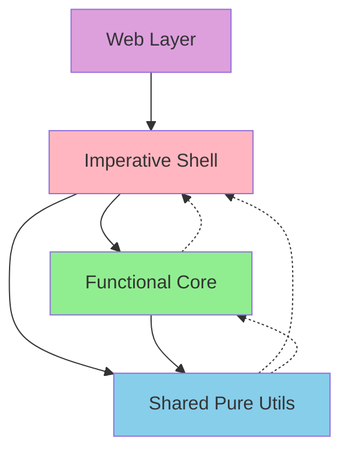

# Project Structure

## Overview

Projects following Functional Core, Imperative Shell should have a clear directory structure that enforces architectural boundaries. The structure should make it immediately obvious where pure functions live versus where side effects occur.

## Standard Directory Layout

### Kotlin/JVM Projects

```
project-root/
├── src/
│   ├── main/
│   │   ├── kotlin/
│   │   │   └── com/example/app/
│   │   │       ├── core/              # Functional Core
│   │   │       │   ├── models/        # Domain models & types
│   │   │       │   │   ├── User.kt
│   │   │       │   │   ├── Order.kt
│   │   │       │   │   └── Payment.kt
│   │   │       │   ├── logic/         # Pure business logic
│   │   │       │   │   ├── OrderCalculator.kt
│   │   │       │   │   ├── PaymentProcessor.kt
│   │   │       │   │   └── UserValidator.kt
│   │   │       │   └── errors/        # Domain error types
│   │   │       │       └── DomainErrors.kt
│   │   │       ├── shell/             # Imperative Shell
│   │   │       │   ├── api/           # HTTP endpoints
│   │   │       │   │   ├── OrderController.kt
│   │   │       │   │   └── UserController.kt
│   │   │       │   ├── db/            # Database access
│   │   │       │   │   ├── entities/
│   │   │       │   │   ├── repositories/
│   │   │       │   │   └── mappers/
│   │   │       │   ├── services/      # Orchestration
│   │   │       │   │   ├── OrderService.kt
│   │   │       │   │   └── EmailService.kt
│   │   │       │   └── config/        # Configuration
│   │   │       │       └── AppConfig.kt
│   │   │       └── shared/            # Shared utilities (pure only)
│   │   │           ├── types/         # Common types
│   │   │           │   ├── Money.kt
│   │   │           │   └── Result.kt
│   │   │           └── utils/         # Pure utilities
│   │   │               └── Extensions.kt
│   │   └── resources/
│   │       ├── application.yml
│   │       ├── db/
│   │       │   └── migration/
│   │       └── templates/
│   └── test/
│       ├── kotlin/
│       │   └── com/example/app/
│       │       ├── core/              # Core unit tests
│       │       ├── shell/             # Integration tests
│       │       ├── property/          # Property-based tests
│       │       └── fixtures/          # Test data
│       └── resources/
│           └── application-test.yml
├── build.gradle.kts
├── gradle.properties
└── settings.gradle.kts

### TypeScript/Node Projects

```
project-root/
├── src/
│   ├── core/                  # Functional Core
│   │   ├── models/            # Domain types
│   │   │   ├── user.ts
│   │   │   ├── order.ts
│   │   │   └── index.ts
│   │   ├── logic/             # Pure business logic
│   │   │   ├── order-calculator.ts
│   │   │   ├── payment-processor.ts
│   │   │   └── user-validator.ts
│   │   ├── errors/            # Domain errors
│   │   │   └── domain-errors.ts
│   │   └── index.ts
│   ├── shell/                 # Imperative Shell
│   │   ├── api/               # HTTP layer
│   │   │   ├── routes/
│   │   │   ├── middleware/
│   │   │   └── server.ts
│   │   ├── db/                # Database layer
│   │   │   ├── entities/
│   │   │   ├── repositories/
│   │   │   └── migrations/
│   │   ├── services/          # External services
│   │   │   ├── email-service.ts
│   │   │   └── payment-gateway.ts
│   │   └── config/            # Configuration
│   │       └── index.ts
│   ├── shared/                # Shared utilities (pure)
│   │   ├── types/             # Common types
│   │   │   ├── result.ts
│   │   │   ├── money.ts
│   │   │   └── branded-types.ts
│   │   └── utils/             # Pure utilities
│   │       └── functional.ts
│   └── index.ts               # Main entry point
├── test/
│   ├── unit/                  # Unit tests
│   ├── integration/           # Integration tests
│   ├── e2e/                   # End-to-end tests
│   └── fixtures/              # Test data
├── package.json
├── tsconfig.json
├── jest.config.js
└── .eslintrc.js

### Elixir/Phoenix Projects

```
project-root/
├── lib/
│   ├── app_core/              # Functional Core
│   │   ├── models/            # Domain structs
│   │   │   ├── user.ex
│   │   │   ├── order.ex
│   │   │   └── payment.ex
│   │   ├── logic/             # Pure business logic
│   │   │   ├── order_processor.ex
│   │   │   ├── payment_calculator.ex
│   │   │   └── user_validator.ex
│   │   ├── state_machines/    # State transition logic
│   │   │   └── order_state_machine.ex
│   │   └── errors.ex          # Domain errors
│   ├── app_shell/             # Imperative Shell
│   │   ├── accounts/          # Contexts (orchestration)
│   │   │   ├── accounts.ex
│   │   │   └── user_service.ex
│   │   ├── repo/              # Database
│   │   │   ├── schemas/
│   │   │   └── queries/
│   │   ├── workers/           # Background jobs
│   │   │   └── email_worker.ex
│   │   └── external/          # External services
│   │       └── payment_gateway.ex
│   ├── app_web/               # Phoenix web layer
│   │   ├── controllers/
│   │   ├── views/
│   │   ├── channels/
│   │   └── router.ex
│   └── app/                   # Application setup
│       ├── application.ex
│       └── repo.ex
├── test/
│   ├── app_core/              # Core unit tests
│   ├── app_shell/             # Shell integration tests
│   ├── app_web/               # Controller tests
│   ├── property/              # Property-based tests
│   └── support/               # Test helpers
├── mix.exs
└── config/
    ├── config.exs
    ├── dev.exs
    ├── test.exs
    └── prod.exs
```

## Module Boundaries

### Dependency Rules



**Solid arrows**: Allowed dependencies  
**Dotted arrows**: Forbidden dependencies

### Build Configuration Examples

#### Kotlin (Gradle)

```kotlin
// build.gradle.kts
plugins {
    kotlin("jvm") version "1.9.0"
}

dependencies {
    // Core module - no framework dependencies
    implementation("io.arrow-kt:arrow-core:1.2.0")
    
    // Shell module - frameworks allowed
    implementation("org.springframework.boot:spring-boot-starter-web")
    implementation("org.springframework.boot:spring-boot-starter-data-jpa")
    
    // Shared module - minimal dependencies
    implementation("org.jetbrains.kotlinx:kotlinx-datetime:0.4.0")
    
    // Testing
    testImplementation("io.kotest:kotest-runner-junit5:5.6.0")
    testImplementation("io.kotest:kotest-property:5.6.0")
}

// Enforce module boundaries with ArchUnit
tasks.test {
    useJUnitPlatform()
    doLast {
        ArchUnitRunner.assertArchitecture()
    }
}
```

#### TypeScript (Package.json)

```json
{
  "name": "fcis-app",
  "scripts": {
    "build": "tsc",
    "test": "jest",
    "test:unit": "jest src/core",
    "test:integration": "jest src/shell",
    "lint": "eslint . --ext .ts",
    "check-boundaries": "dependency-cruiser src"
  },
  "devDependencies": {
    "@types/jest": "^29.0.0",
    "@typescript-eslint/eslint-plugin": "^5.0.0",
    "dependency-cruiser": "^13.0.0",
    "jest": "^29.0.0",
    "ts-jest": "^29.0.0",
    "typescript": "^5.0.0"
  }
}
```

#### Boundary Enforcement (.dependency-cruiser.js)

```javascript
module.exports = {
  forbidden: [
    {
      name: 'core-depends-on-shell',
      severity: 'error',
      from: { path: '^src/core' },
      to: { path: '^src/shell' }
    },
    {
      name: 'shared-depends-on-shell',
      severity: 'error', 
      from: { path: '^src/shared' },
      to: { path: '^src/shell' }
    },
    {
      name: 'core-imports-frameworks',
      severity: 'error',
      from: { path: '^src/core' },
      to: { 
        path: 'node_modules/(express|koa|fastify|typeorm|prisma|knex)'
      }
    }
  ]
}
```

## Configuration Management

### Environment-Specific Config

```typescript
// src/shell/config/index.ts
export interface Config {
  readonly app: AppConfig
  readonly db: DatabaseConfig
  readonly email: EmailConfig
  readonly features: FeatureFlags
}

// Pure config validation
export function parseConfig(env: NodeJS.ProcessEnv): Result<Config, ConfigError> {
  return pipe(
    { app: parseAppConfig(env), 
      db: parseDatabaseConfig(env),
      email: parseEmailConfig(env),
      features: parseFeatureFlags(env) },
    validateConfig
  )
}

// src/shell/config/loader.ts (imperative)
export async function loadConfig(): Promise<Config> {
  const result = parseConfig(process.env)
  
  if (result.kind === 'err') {
    console.error('Configuration errors:', result.error)
    process.exit(1)
  }
  
  return result.value
}
```

### Feature Flags

```elixir
# lib/app_core/features.ex
defmodule AppCore.Features do
  @type feature :: :new_payment_flow | :enhanced_search | :beta_ui
  
  @spec enabled?(feature(), map()) :: boolean()
  def enabled?(feature, flags) do
    Map.get(flags, feature, false)
  end
  
  @spec required_features([feature()], map()) :: {:ok, :all_enabled} | {:error, [feature()]}
  def required_features(features, flags) do
    disabled = Enum.reject(features, &enabled?(&1, flags))
    
    case disabled do
      [] -> {:ok, :all_enabled}
      missing -> {:error, missing}
    end
  end
end
```

## Build and Deploy Structure

### Docker Configuration

```dockerfile
# Dockerfile
FROM node:18-alpine AS builder

WORKDIR /app
COPY package*.json ./
RUN npm ci

COPY tsconfig.json ./
COPY src ./src
RUN npm run build

FROM node:18-alpine AS runtime

WORKDIR /app
COPY package*.json ./
RUN npm ci --production

COPY --from=builder /app/dist ./dist

EXPOSE 3000
CMD ["node", "dist/index.js"]
```

### CI/CD Pipeline Structure

```yaml
# .github/workflows/ci.yml
name: CI

on: [push, pull_request]

jobs:
  test-core:
    runs-on: ubuntu-latest
    steps:
      - uses: actions/checkout@v3
      - name: Test Functional Core
        run: |
          npm ci
          npm run test:unit

  test-integration:
    runs-on: ubuntu-latest
    services:
      postgres:
        image: postgres:15
    steps:
      - uses: actions/checkout@v3
      - name: Test Imperative Shell
        run: |
          npm ci
          npm run test:integration

  check-boundaries:
    runs-on: ubuntu-latest
    steps:
      - uses: actions/checkout@v3
      - name: Check Architecture Boundaries
        run: |
          npm ci
          npm run check-boundaries
```

## Documentation Structure

```
docs/
├── architecture/
│   ├── README.md              # Architecture overview
│   ├── core-patterns.md       # Core patterns guide
│   └── shell-patterns.md      # Shell patterns guide
├── api/
│   ├── rest-api.md           # REST API documentation
│   └── graphql-schema.md     # GraphQL schema
├── domain/
│   ├── models.md             # Domain model documentation
│   ├── state-machines.md     # State machine diagrams
│   └── glossary.md           # Domain terminology
└── development/
    ├── setup.md              # Development setup
    ├── testing.md            # Testing guide
    └── deployment.md         # Deployment guide
```

## Common Patterns

### Shared Types Module

```typescript
// src/shared/types/index.ts
export * from './result'
export * from './money'
export * from './branded-types'
export * from './non-empty-array'

// Re-export commonly used combinations
export type ValidationResult<T> = Result<T, ValidationError[]>
export type AsyncResult<T, E> = Promise<Result<T, E>>
```

### Core Module Exports

```kotlin
// src/core/index.kt
package com.example.app.core

// Only export public API, hide implementation details
export class UserCore {
    companion object {
        fun createUser(request: CreateUserRequest): Result<User, ValidationError>
        fun updateProfile(user: User, updates: ProfileUpdate): Result<User, ValidationError>
        fun deactivateUser(user: User, reason: DeactivationReason): User
    }
}

// Don't export internal helpers
internal fun validateEmail(email: String): Result<Email, ValidationError>
internal fun normalizePhoneNumber(phone: String): String
```

## Anti-Patterns to Avoid

1. **Mixed Concerns in Modules**: Don't put database entities in the core
2. **Circular Dependencies**: Core should never import from shell
3. **Framework Pollution**: Keep frameworks confined to the shell
4. **Scattered Configuration**: Centralize all config in shell/config
5. **Test Pollution**: Don't let test code leak into production modules

This structure ensures clear boundaries between pure and impure code, making the codebase easier to understand, test, and maintain.